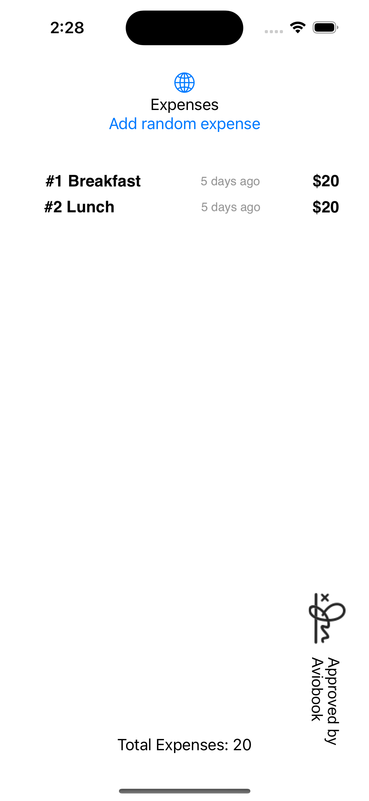

# Expense Report

Aviobook started to build an Expense Tracker, the developer who started working on the feature went on sick leave suddenly, he did commit all the work he completed until now.

You are the assigned developer to complete this feature, you get `carte blanche` to deliver this app as long as you follow all the acceptance criteria.

An example screenshot can be found here:

You always start with an empty list of expenses, if you hit the button `add random expense` it will create an extra expense item, which will be displayed in a row below.

Each expense in the row represents:
* an order number
* the type name
* expense from nr of days ago (calculated based on the difference between the current date and the random date for the Expense)
* The price in dollars

Whenever a custom item is added, it should also be reflected in the total expenses. For the total Expenses, we should use a UIView called `TotalView`and a model `ExpenseTotal` (which should be re-usable for older UIKit projects) this view should contain a view with the total amount of expenses (the sum price of all expenses) and an `Approval stamp` from Aviobook.

Finally, if the total expenses of `dinner` is higher than 5000 or the total expenses of `lunch` is higher than 1000 - you should disable the `add random expense` button.

Do extensively focus on the business logic implementation. In the end we expect the code and architecture that you’ve touched to be clean, maintainable, adaptable and testable. Please verify that your app is running on the simulator and all tests are succeeding.

During the interview, we’ll go over the implementation and do some live code changes as well. Make sure you can motivate every decision you made and that you can reason about their pros and cons. Don’t be afraid, there’s no correct answer!